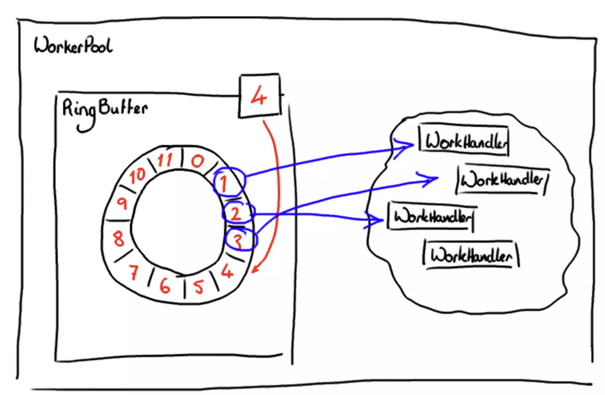

# Simple Daemon and Ring Buffer

This project was an assignment in context of Thread-safe Low-Level Operating Systems Programming. The idea is based around producer consumer problem (writer worker threads & reader worker threads) that utilizes limited in size but circular (after end comes begin) logic. 

This basic implementation still has a limitation on parallel accessing. Only one worker at a time can access the ring buffer.
My own code inside src/* that is marked.

## Overview

This project consists of two main components: a simple daemon for processing network connections and a thread-safe ring buffer implementation. The simple daemon simulates network traffic and processes it using multiple threads, while the ring buffer handles data in a lock-free, thread-safe manner.

## Files

- `daemon.h`: Contains the definition of the `simpledaemon` function and the `connection_t` structure.
- `daemon.c`: Contains reader and writer thread-safe functions as well as daemon for threads management.
- `ringbuf.h`: Contains the definitions and function declarations for the ring buffer.
- `ringbuf.c`: Implements the ring buffer functions.

## Ring Buffer Functionality

The ring buffer is a circular buffer data structure that efficiently handles data in a first-in, first-out (FIFO) manner. It is designed to be thread-safe and lock-free, allowing concurrent access by multiple producer and consumer threads without the need for complex synchronization mechanisms.

### Key Features
Thread-Safe and Lock-Free: The ring buffer is designed to allow concurrent reads and writes by multiple threads without requiring locks for every operation, improving performance in multi-threaded environments.

Circular Buffer: The ring buffer reuses its storage by wrapping around when the end of the buffer is reached, making efficient use of memory.

Synchronization Mechanisms: The buffer uses mutexes and condition variables to handle synchronization between producer and consumer threads, ensuring safe access to shared data.

## Daemon Functionality

The daemon simulates network traffic by reading from files, which represent network packets, and writes them to the ring buffer. Multiple writer threads simulate different network connections, and multiple reader threads process the messages from the ring buffer.

## Firewall Functionality
The daemon includes a firewall function that filters messages based on port numbers and content. Messages can be blocked if they meet certain conditions, such as containing the word "malicious" or having specific port configurations.

## Forwarding Functionality
Messages that pass the firewall are written to files named after their destination ports. This simulates port forwarding in a network.